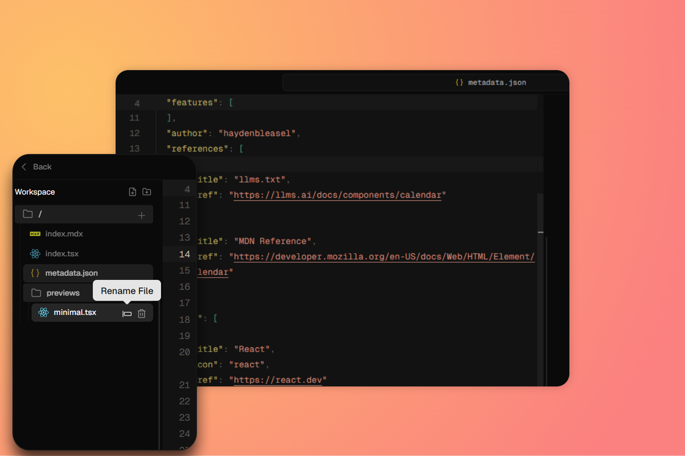
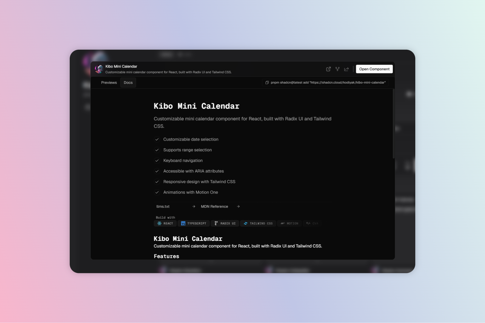
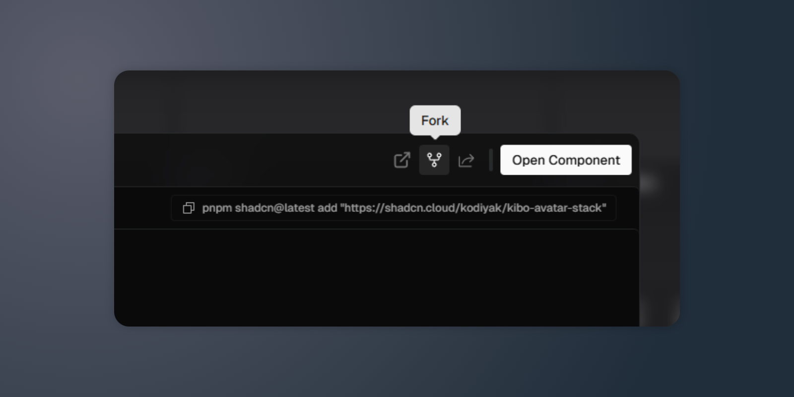
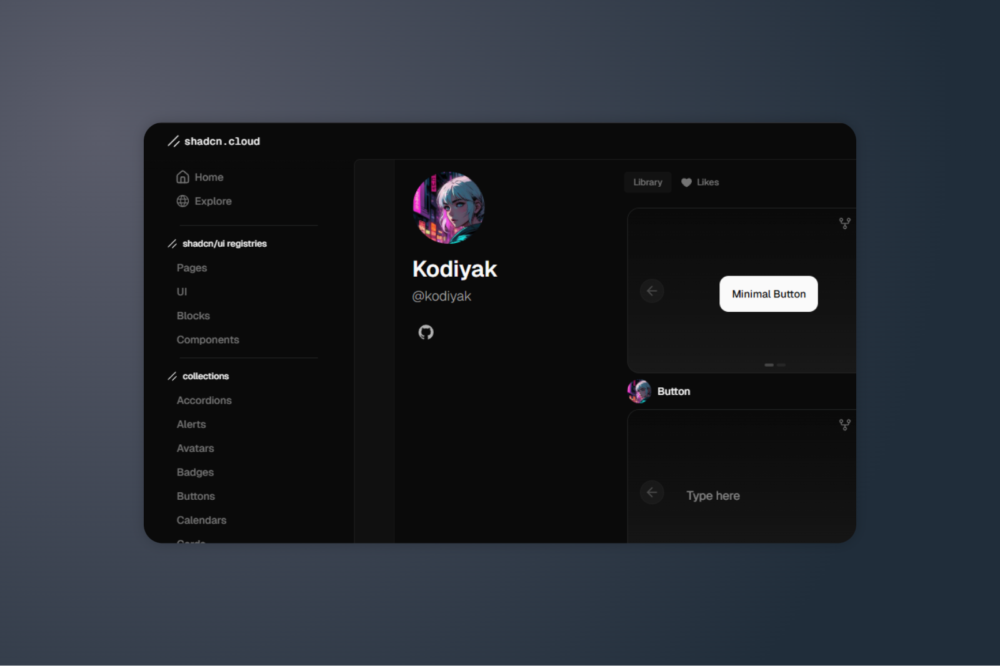

# 🌥️ shadcn.cloud

A web-based platform to document, edit, and share components from the [`shadcn/ui`](https://ui.shadcn.dev/) ecosystem — with live previews, instant editing, and modpack-based architecture.

> 📦 Built for indie developers, design system creators, and DX fanatics.

---

## 🚀 Features

- ✍️ Real-time editing of each component’s `index.mdx` and `metadata.json`.
- ♻️ React Fast Refresh support out of the box.
- 🧠 MDX-based documentation with full JSX support.
- 🪄 GitHub integration planned: display author avatar, social links, like/save/fork buttons.
- 🧩 Modular architecture powered by [modpack](https://github.com/kodiyak/modpack) — hot-reload individual components.
- 🌈 Fully Tailwind-compatible with runtime themes and design tokens.
- 📤 Designed to become a marketplace for selling, remixing, and showcasing frontend components.

---

## 📦 Installation (WIP)

> Currently in active development. Feel free to clone and explore:

```bash
git clone https://github.com/kodiyak/shadcn-cloud
cd shadcn-cloud
pnpm install
pnpm dev
```

## 🌐 Vision
`shadcn.cloud` aims to be a **Playground + CMS + Marketplace** for **UI components**, empowering:
- Creators who want to sell or share their custom UI components.
- Teams who need MDX-ased internal documentation with live previews.
- Tools that require fbast iteration, clean visuals, and strong developer experience.

## 🧠 Architecture
- React + Next.js
- SWC + es-module-shims for runtime component preview
- Tailwind CSS with CSS variables and theme support
- Monaco Editor with full JSX/TSX support

## ✨ Screenshots

**Live editing with instant feedback**


**The source of truth, beautifully rendered**


**Remix-ready by design**


**Effortless dev identity**


## 🧑‍💻 Author
Built with coffee and care by [@kodiyak](https://x.com/mathews536)
Also check out: [modpack](https://github.com/kodiyak/modpack) · [lofi.surf](https://github.com/lofizone)